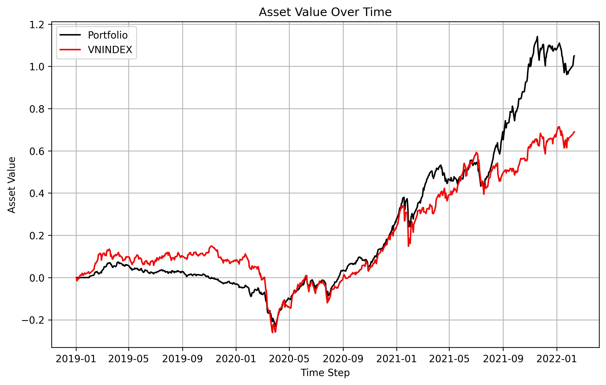
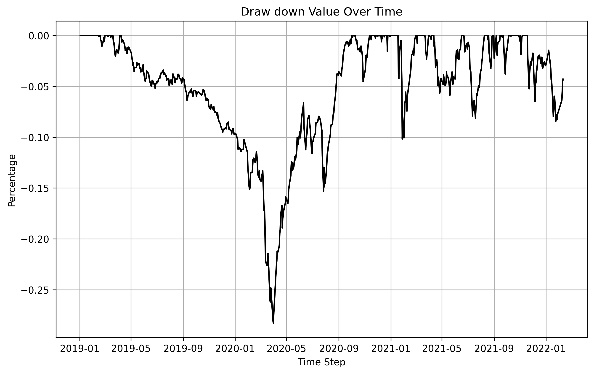
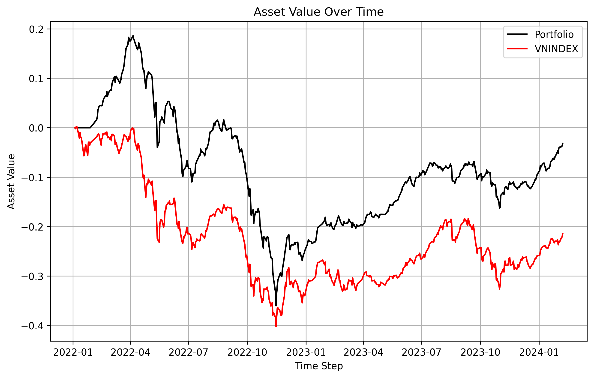
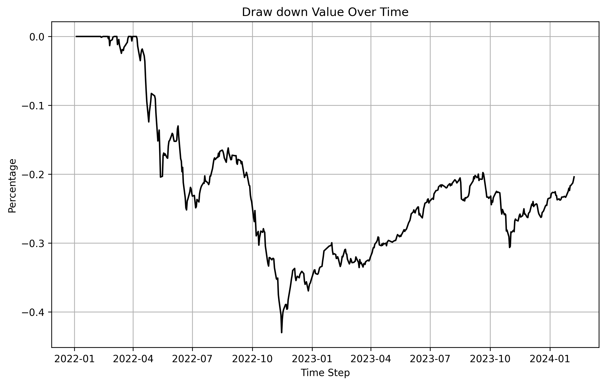

# PROTO:Smart Beta

## PE and Devidend Yeild
> Select stocks based on P/E and Devidend Yeild

## Abstract
In this project, we use the P/E ratio and dividend yield to select and hold stocks in the Vietnamese stock market. The portfolio is rebalanced on the first day of each month; if that day is a holiday, rebalancing is carried out on the next trading day.

## Introduction
In value investing, one common approach to stock selection involves identifying undervalued companies with strong income potential. This strategy leverages two key financial metrics: the Price-to-Earnings (P/E) ratio and the dividend yield. The P/E ratio helps assess whether a stock is trading at a reasonable price relative to its earnings, while the dividend yield highlights its income-generating potential.

The core idea is to select stocks with a low P/E ratio and a high dividend yield, as these stocks may represent undervalued opportunities that also offer steady cash returns. This method is particularly effective in mature or stable markets, such as the Vietnamese stock market, where dividend-paying companies are often more established and financially sound.

## Hypothesis
We filter and maintain a portfolio of stocks with a price-to-earnings (P/E) ratio within the range of (0, 15) and a dividend yield (DY) greater than 0.01. The dividend yield is calculated as:
- DY = DPS / Price

where DPS denotes dividends per share. Existing holdings are sold before purchasing new stocks at each rebalancing period.

## Data
- Data source: Algotrade database
- Data period: from 2022-01-01 to 2025-01-01
- Financial and closing price data are extracted and stored in a .csv file to reduce the time required for subsequent actions.
- Each sell or buy side will be charge 0.035% fee.
### Data collection
#### Daily closing price data
- The daily close price is collected from Algotrade database using SQL queries. 
- The data is collected using the script `data_loader.py` 
- The data is stored in the `data/pe_dps.csv` and `data/vnindex.csv` files. 

#### Financial data
- P/E and DPS are calculated based on:
    - Net Profit After Tax Atributed To Shareholder
    - Outstanding share
    - Dividends paid
- The data is also collected using the `data_loader.py` file.

## Implementation
### Environment Setup
1. Set up python virtual environment
```bash
python -m venv venv
source venv/bin/activate # for Linux/MacOS
.\venv\Scripts\activate.bat # for Windows command line
.\venv\Scripts\Activate.ps1 # for Windows PowerShell
```
2. Install the required packages
```bash
pip install -r requirements.txt
```
3. (OPTIONAL) Create `.env` file in the root directory of the project and fill in the required information. The `.env` file is used to store environment variables that are used in the project. The following is an example of a `.env` file:
```env
DB_NAME=<database name>
DB_USER=<database user name>
DB_PASSWORD=<database password>
DB_HOST=<host name or IP address>
DB_PORT=<database port>
```
### Data Collection
#### Option 1. Download from Google Drive
Data can be download directly from [Google Drive](https://drive.google.com/drive/folders/1bXCaGEwNrALZ7ussTXD8k9iaAFvw1ZIu?usp=sharing). The data files are stored in the `data` folder with the following folder structure:
```
data
├── is
│   ├── pe_dps.csv
│   └── vnindex.csv
└── os
    ├── pe_dps.csv
    └── vnindex.csv
```
You should place this folder to the current ```PYTHONPATH``` for the following steps.
#### Option 2. Run codes to collect data
To collect data from database, run this command below in the root directory:
```bash
python data_loader.py
```
The result will be stored in the `data/pe_dps.csv` and `data/vnindex.csv`
### In-sample Backtesting
Specify period and parameters in `parameter/backtesting_parameter.json` file.
```bash
python backtesting.py
```
The results are stored in the `result/backtest/` folder.

### Optimization
To run the optimization, execute the command in the root folder:
```bash
python optimization.py
```
The optimization parameter are store in `parameter/optimization_parameter.json`. After optimizing, the optimized parameters are stored in `parameter/optimized_parameter.json`.

### Out-of-sample Backtesting
[TODO: change the script name to out_sample_backtest.py or something like that]: #
To run the out-of-sample backtesting results, execute this command
```bash
python evaluation.py
```
[TODO: change the name of optimization folder to out-of-sample-backtesting or something like that]: #
The script will get value from `parameter/optimized_parameter.json` to execute. The results are stored in the `result/optimization` folder.

## In-sample Backtesting
Running the in-sample backtesting by execute the command:
```bash
python backtesting.py
```
### Evaluation Metrics
- Backtesting results are stored in the `result/backtest/` folder. 
- Used metrics to compare with VNINDEX are: 
  - Sharpe ratio (SR)
  - Sortino ratio (SoR)
  - Information ratio (Inf)
  - Maximum drawdown (MDD)
- We use a risk-free rate of 6% per annum, equivalent to approximately 0.023% per day, as a benchmark for evaluating the Sharpe Ratio (SR) and Sortino Ratio (SoR).
### Parameters
### In-sample Backtesting Result
- The backtesting results with VNINDEX benchmark is constructuted from 2019-01-01 to 2022-01-01.
```
| Metric                 | Value                              |
|------------------------|------------------------------------|
| Sharpe Ratio           | 1.2971                             |
| Information Ratio      | 0.0298                             |
| Sortino Ratio          | 1.7297                             |
| Maximum Drawdown (MDD) | -0.2828                            |
```
- The NAV chart. The chart is located at: `result/backtest/nav.png`

- Drawdown chart. The chart is located at `result/backtest/drawdown.png`


## Optimization
The configuration of optimization is stored in `parameter/optimization_parameter.json` you can adjust the range of parameters. Random seed is used for reconstructing the optimization process. The optimized parameter is stored in `parameter/optimized_parameter.json`
The optimization process can be reproduced by executing the command:
```bash
python optimization.py
```
The currently found optimized parameters with the seed `2024` are:
```json
{
    "pe": [0, 10],
    "dy": [0.056272982721535775, 1e6]
}
```
## Out-of-sample Backtesting
- Specify the out-sample period and parameters in `parameter/backtesting_parameter.json` file.
- The out-sample data is loaded on the previous step. Refer to section [Data](#data) for more information.
- To evaluate the out-sample data run the command below
```bash
python evaluation.py
```
### Out-of-sample Backtesting Result
- The out-sample backtesting results with VNINDEX benchmark is constructuted from 2022-01-01 to 2024-01-01.
```
| Metric                 | Value                              |
|------------------------|------------------------------------|
| Sharpe Ratio           | -0.3497                            |
| Information Ratio      | 0.0470                             |
| Sortino Ratio          | -0.4363                            |
| Maximum Drawdown (MDD) | -0.4604                            |
```
- The NAV chart. The chart is located at `result/optimization/nav.png`.

- Drawdown chart. The chart is located at `result/optimization/drawdown.png`.


## Reference
[1] ALGOTRADE, Algorithmic Trading Theory and Practice - A Practical Guide with Applications on the Vietnamese Stock Market, 1st ed. DIMI BOOK, 2023, pp. 64–67. Accessed: Apr. 30, 2025. [Online]. Available: [Link](https://hub.algotrade.vn/knowledge-hub/smart-beta-strategies/)

[2] ALGOTRADE, “Weighting Methods Used in Smart-Beta Strategy,” [Website](https://algotrade.vn), Jul. 10, 2024. Available: [Link](https://hub.algotrade.vn/knowledge-hub/weighting-methods-used-in-smart-beta-strategy/) (accessed Apr. 30, 2025).